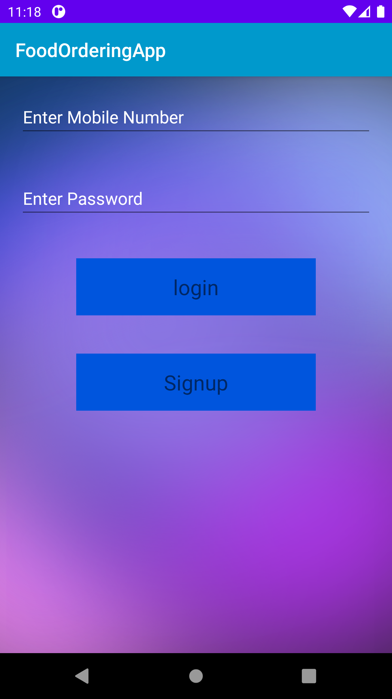
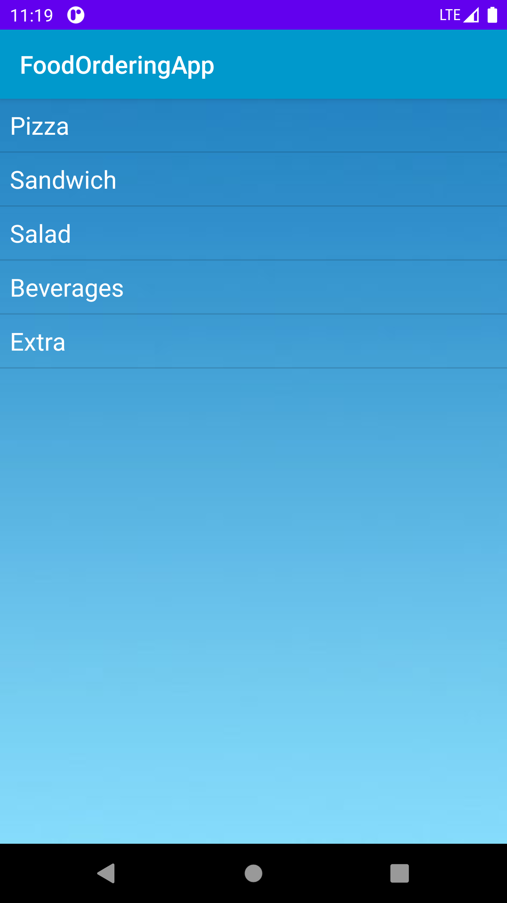
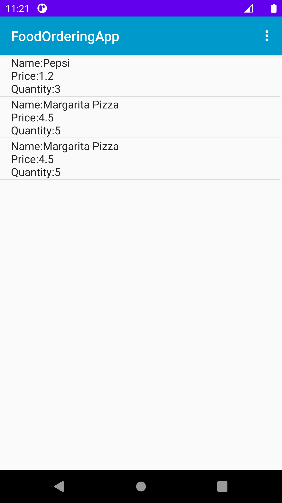
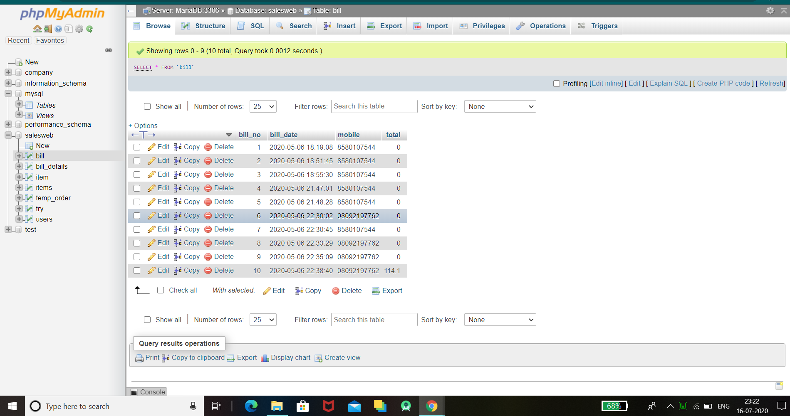

# An android food ordering app using Kotlin , XML(for UI),php and Sql(for database).

# User can login with his/her credentials.

## The Food Menu.

## Order Summary

# All orders are saved in the database with date and time. 

